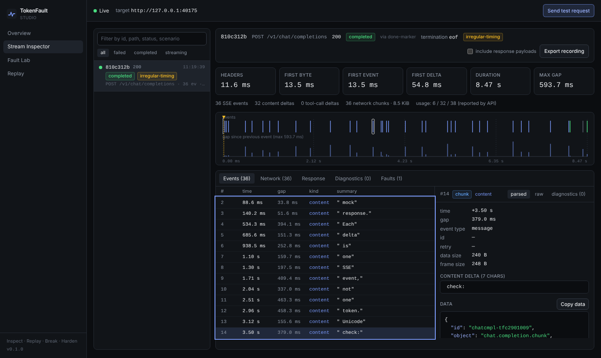

# TokenFault

**Inspect. Replay. Break. Harden.**

An open-source debugging, observability and fault-injection toolkit for AI streaming applications.

TokenFault sits between your application and an OpenAI-compatible Chat Completions API. It shows every
Server-Sent Event as it arrives, measures the stream's timing, and breaks the stream on purpose:
slow starts, mid-stream disconnects, 429/503, stalls, jitter, fragmented frames, malformed data and
fragmented tool calls. Every failure is deterministic and reproducible. Everything runs locally, and the
bundled mock LLM means you need no API key, paid model or cloud account.



> **Status: 0.1.0, pre-release.** It works end to end and is covered by unit, integration, contract,
> CLI smoke, external-install and browser tests. The packages are release-ready but **not published to npm** yet,
> so install from source. See
> [Implementation status](docs/engineering/IMPLEMENTATION_STATUS.md) for what is and isn't done.

## What it is (and isn't)

TokenFault is a **developer reliability tool**. It is not an LLM gateway, model router, chatbot or analytics product.
It does not rewrite prompts, cache responses, balance load or hold API keys.

| Area           | What you get                                                                                                                                                                                                                                                                                         |
| -------------- | ---------------------------------------------------------------------------------------------------------------------------------------------------------------------------------------------------------------------------------------------------------------------------------------------------- |
| Streaming core | Incremental, byte-level SSE decoder (WHATWG rules: LF/CR/CRLF, split UTF-8, multi-line data, `id`/`retry`/comments, bounded memory, diagnostics with byte offsets) and an OpenAI chat-completions interpreter (content, role, tool-call deltas, `finish_reason`, usage, in-stream errors, `[DONE]`). |
| Proxy          | A streaming proxy locked to one upstream. Backpressure, cancellation propagation, header/idle/total timeouts, honest failure propagation, safe header forwarding.                                                                                                                                    |
| Fault engine   | Nine scenarios (A–I) and nine composable fault types. Validated, seeded and deterministic. Pre-response faults are kept separate from in-stream faults.                                                                                                                                              |
| Mock LLM       | `POST /v1/chat/completions` (streaming and non-streaming, tool calls) with deterministic output and per-request fault selection.                                                                                                                                                                     |
| Recording      | A versioned, schema-validated recording format. Payloads are excluded unless you opt in. Credentials and prompts are never stored.                                                                                                                                                                   |
| Replay         | Byte-exact (chunk) or event-level replay with original, scaled or fixed timing, locally, into the Studio, or served over HTTP to your app.                                                                                                                                                           |
| Studio         | A local web UI: live sessions, event timeline, event details, network chunks, assembled response, diagnostics, Fault Lab, Replay.                                                                                                                                                                    |
| CLI            | `tokenfault proxy · mock · inspect · scenarios · replay · doctor`.                                                                                                                                                                                                                                   |
| Testing        | `@tokenfault/testing`: start the mock and proxy in-process and assert on measured stream behaviour from your own test suite.                                                                                                                                                                         |

## Quick start

Requirements: Node.js ≥ 22.12, pnpm 10.

```bash
git clone https://github.com/mohamed-bal/Token-Fault.git tokenfault
cd tokenfault
pnpm install
pnpm build

# Proxy + embedded mock LLM + Studio on http://127.0.0.1:8787
pnpm tokenfault proxy --mock
```

Open the Studio URL it prints (`http://127.0.0.1:8787/__tokenfault/studio/`), sign in with the **control token** printed
next to it, and click **Send test request**. The token is new on every start (see [Security model](#security-model)).
From a second terminal:

```bash
pnpm tokenfault inspect                                     # live event view + metrics
pnpm tokenfault inspect --scenario mid-stream-disconnect    # exit code 3: stream incomplete
pnpm tokenfault inspect --scenario mid-stream-disconnect --record broken.tfrec.json
pnpm tokenfault replay broken.tfrec.json                    # reproduces the failure, no model contacted
```

### Point your application at it

TokenFault is a drop-in base URL for OpenAI-compatible SDKs:

```ts
import OpenAI from 'openai';

const client = new OpenAI({
  apiKey: process.env.OPENAI_API_KEY, // forwarded upstream as-is, never logged or stored
  baseURL: 'http://127.0.0.1:8787/v1', // the proxy (printed as "base URL" at startup)
});

const stream = await client.chat.completions.create(
  { model: 'gpt-4o-mini', stream: true, messages: [{ role: 'user', content: 'Hi' }] },
  { headers: { 'x-tokenfault-scenario': 'stream-stall' } }, // optional: break this one request
);
```

To use a real provider, run `pnpm tokenfault proxy --target https://api.openai.com`.
The target is fixed at startup and is never taken from a request.

## Fault scenarios

Select a scenario per request with `x-tokenfault-scenario: <id>`, for every request with `--scenario <id>`,
or from the Studio's Fault Lab. `x-tokenfault-scenario: none` opts a single request out.

| Id                         | Behaviour                                                              | Applies to  |
| -------------------------- | ---------------------------------------------------------------------- | ----------- |
| A `slow-first-response`    | First byte delayed 2 s, first content delta a further 1.5 s            | proxy, mock |
| B `mid-stream-disconnect`  | TCP reset after 5 events (no `[DONE]`, no `finish_reason`)             | proxy, mock |
| C `rate-limit-429`         | `429` + `Retry-After: 2` before streaming. Upstream not contacted.     | proxy, mock |
| D `server-unavailable-503` | `503` before streaming. Upstream not contacted.                        | proxy, mock |
| E `stream-stall`           | 4 s pause after event 3, then the stream resumes                       | proxy, mock |
| F `irregular-timing`       | Seeded jitter of 0–600 ms before each event                            | proxy, mock |
| G `fragmented-sse`         | Every frame split into 1–7 byte network writes (splits UTF-8 and CRLF) | proxy, mock |
| H `malformed-data`         | One deliberately truncated JSON event after event 3                    | proxy, mock |
| I `fragmented-tool-calls`  | Tool-call arguments streamed 3 characters at a time                    | mock¹       |

¹ Through the proxy, scenario I is delegated to the upstream. It only takes effect when the upstream is the TokenFault mock.

For full control, send a JSON profile in `x-tokenfault-faults`:

```json
{
  "seed": 7,
  "faults": [
    { "type": "jitter", "minGapMs": 0, "maxGapMs": 250 },
    { "type": "disconnect", "afterEvents": 12, "mode": "end" }
  ]
}
```

Fault types: `delay-first-byte`, `delay-first-content`, `http-error`, `disconnect` (`reset` | `destroy` | `end`),
`stall`, `jitter`, `fragment`, `malformed` (`truncated-json` | `invalid-utf8` | `missing-blank-line` | `unknown-field` |
`html-error-page`) and `fragment-tool-calls` (mock only). `pnpm tokenfault scenarios` lists every parameter and its bounds.
Once headers are sent, the status code cannot change, so in-stream failures are always disconnects, stalls or malformed data.

## CLI

```text
tokenfault proxy (--target <url> | --mock) [--port 8787] [--scenario <id>] [--record-dir <dir> [--record-payloads]]
                 [--no-capture-payloads] [--headers-timeout-ms n] [--idle-timeout-ms n] [--allow-remote] [--no-studio]
tokenfault mock [--port 4010] [--scenario <id>] [--interval-ms 20]
tokenfault inspect [--url <endpoint> | --mock] [--prompt|--body|--body-file] [--scenario|--faults] [--api-key-env NAME]
                   [--json] [--record <file> [--record-payloads]]
tokenfault scenarios [--json]
tokenfault replay <file> [--speed <factor> | --fixed-gap-ms <n>] [--serve [--port 4020]] [--json]
tokenfault doctor [--target <url>] [--record-dir <dir>] [--json]
```

Exit codes: `0` success, `1` error, `2` usage error, `3` the stream did not complete (`inspect`/`replay`), `130` interrupted.
API keys are read only from environment variables (`--api-key-env`), never from command-line values.

## Measured metrics

Every number comes from real I/O timestamps or from the API itself:

- Time to response headers, first byte, first SSE event and first content/tool-call delta
- Inter-event gaps: min/mean/p50/p95/p99/max (nearest-rank, no interpolation)
- Duration, event count, network-chunk count, byte count, content and tool-call delta counts
- Outcome (`completed` via `[DONE]` or `finish_reason`, `incomplete`, `stream-error`, `http-error`, `non-stream`) and how the
  transport ended (`eof`, `client-abort`, `upstream-reset`, `upstream-timeout`, `fault-disconnect`, …)

SSE events and content deltas are **not** tokens. Token usage is shown only when the API reports it. The mock's
`usage` numbers are synthetic counts and are documented as such.

## Testing your client

```ts
import { startStack, streamChatCompletion } from '@tokenfault/testing';

const stack = await startStack(); // mock + proxy on ephemeral loopback ports
const result = await streamChatCompletion(stack.proxy.url, { scenario: 'mid-stream-disconnect' });
result.snapshot.outcome; // 'incomplete'
result.termination.kind; // 'upstream-reset'
await stack.close();
```

[`examples/basic-client`](examples/basic-client) contains a reference client with first-byte and idle timeouts, `[DONE]`
verification and `Retry-After`-aware retries. Its behaviour against each scenario is covered by
`tests/integration/example-client.test.ts`.

> The packages are not published to npm yet. Until they are, `@tokenfault/testing` can be used from within this
> repository (or via a workspace/`file:` dependency).

## Supported protocols

| Protocol                                          | Status                                                                                  |
| ------------------------------------------------- | --------------------------------------------------------------------------------------- |
| OpenAI-compatible Chat Completions, SSE streaming | **Supported**. Verified with contract tests against the official `openai` Node SDK 5.x. |
| OpenAI-compatible Chat Completions, non-streaming | Forwarded and inspected as JSON (outcome `non-stream`)                                  |
| Generic SSE                                       | Decoded and shown; chat interpretation reports unrecognised payloads                    |
| OpenAI Responses API, Anthropic Messages API      | **Not supported** (planned; no adapter or contract tests yet)                           |
| WebSockets, HTTP/2 upstream, gRPC                 | Not supported                                                                           |

## Security model

TokenFault is a local developer tool. Its defaults assume one developer on one machine.

- **Loopback by default.** The proxy and mock bind `127.0.0.1`. Binding any other address requires `--allow-remote`.
- **Not an open proxy.** The upstream is fixed at startup. Absolute-form and `//host` request targets, dot-segment and
  encoded-slash base-path escapes, and credentials in the target URL are all rejected.
- **Control plane requires a token.** Every run generates a random control token and prints it once. Tools send it as
  `Authorization: Bearer <token>`; the Studio exchanges it for an `HttpOnly`, `SameSite=Strict` session cookie, so the token
  is never stored in the browser or put in a URL. Set `TOKENFAULT_CONTROL_TOKEN` to choose your own, or pass
  `--no-control-auth` to disable it (not recommended on shared machines). `@tokenfault/testing` handles the token for you.
- **Control plane is loopback-only.** `/__tokenfault/*` (Studio and API) also requires a loopback peer **and** a loopback `Host`
  header (DNS-rebinding protection). `tokenfault replay --serve` applies the same `Host` check. Cross-site and cross-origin writes are rejected, JSON is required, and no CORS headers are
  sent. The data path also rejects non-loopback `Host` headers unless `--allow-remote` is set.
- **Secrets.** `Authorization` and other credentials are forwarded upstream unchanged but never logged, captured, recorded or
  shown. Query-string values are redacted. Error messages are scrubbed of key-shaped strings.
- **Privacy defaults.** Prompts and request headers are never captured. Response payloads are kept **in memory only**
  (bounded, lost on exit; `--no-capture-payloads` disables this). Recordings exclude payloads unless you pass
  `--record-payloads`. Recording files are created with mode `0600` (POSIX; Windows uses the directory's ACL) and never
  overwritten.
- **Bounded resources.** Body sizes, event sizes, sessions, events per session, captured bytes, recording size and live-feed
  buffers all have limits.
- **TLS** verification is never disabled.
- **Forwarded content is sandboxed.** Responses on the data path carry `Content-Security-Policy: sandbox` and `nosniff`, so
  upstream HTML cannot run script in the Studio's origin.

Read the [threat model](docs/engineering/THREAT_MODEL.md) for details and residual risks, and [SECURITY.md](SECURITY.md) to report a vulnerability.
TokenFault has not had an external security audit.

## Architecture

```text
 your app ──HTTP──► TokenFault proxy ───────────────► upstream (OpenAI-compatible API or TokenFault mock)
                     │  pre-response faults
                     │  FaultedResponseWriter: SSE framing → fault planner → backpressured writes
                     │  StreamInspector: SSE decoder → chat interpreter → metrics/diagnostics
                     ▼
               SessionStore (bounded) ──► live SSE feed ──► Studio (React)
                     │                └─► control API (loopback + token)
                     └─► recorder (optional, 0600, retention)      replay ◄── .tfrec.json
```

| Package                | Responsibility                                                                                                                                         |
| ---------------------- | ------------------------------------------------------------------------------------------------------------------------------------------------------ |
| `@tokenfault/shared`   | Wire contracts, limits, redaction. No runtime dependencies. Browser-safe.                                                                              |
| `@tokenfault/core`     | SSE decoder/framer/encoder, chat interpreter, inspector, fault engine, recording, replay. Browser-safe root; Node adapters in `@tokenfault/core/node`. |
| `@tokenfault/mock-llm` | Deterministic OpenAI-compatible mock server.                                                                                                           |
| `@tokenfault/proxy`    | Streaming proxy, session store, control API, live feed, recorder, replay manager/server, Studio host.                                                  |
| `@tokenfault/testing`  | In-process stacks, measuring client, control-API client.                                                                                               |
| `tokenfault` (cli)     | The `tokenfault` binary.                                                                                                                               |
| `@tokenfault/studio`   | The Studio web UI (private; its build is bundled into the `tokenfault` package).                                                                       |

See [ARCHITECTURE.md](ARCHITECTURE.md) and the [decision log](docs/engineering/DECISIONS.md).

## Limitations

- Only OpenAI-compatible Chat Completions is interpreted (see _Supported protocols_).
- Upstream requests do not go through `HTTP(S)_PROXY`. `tokenfault doctor` warns when those variables are set.
- The proxy requests `accept-encoding: identity`. If an upstream compresses anyway, bytes are forwarded untouched but not inspected.
- Request bodies are buffered (bounded, 20 MiB by default) before forwarding. Response bodies are always streamed.
- Sessions live in memory only (200 by default). Recordings are the persistence mechanism.
- Replay reproduces recorded bytes or events and their timing. It does not regenerate a model response.
- Fragment timing depends on the OS network stack: separate writes usually arrive as separate reads, but TCP does not guarantee it.
- CI covers Linux (Node 22 and 24), Windows and macOS (Node 22); the Studio browser tests run on Linux only. See
  [Implementation status](docs/engineering/IMPLEMENTATION_STATUS.md) for the latest results per platform.

## Development

```bash
pnpm install
pnpm build            # all packages + Studio
pnpm typecheck
pnpm lint
pnpm test             # unit + integration (Vitest)
pnpm smoke            # CLI smoke test against the built binary
pnpm test:e2e         # Playwright (Chromium) Studio journey and accessibility checks
pnpm test:pack        # pack and install the packages outside the repo (needs the npm registry)
pnpm bench            # benchmarks (measurement only; see docs/engineering/BENCHMARKS.md)
pnpm verify           # everything above, in order
pnpm --filter @tokenfault/studio dev   # Studio dev server; proxies the API to a running `tokenfault proxy`
```

See [CONTRIBUTING.md](CONTRIBUTING.md). The roadmap is in [ROADMAP.md](ROADMAP.md), changes are in [CHANGELOG.md](CHANGELOG.md),
and the release process and readiness gates are in [RELEASE.md](docs/engineering/RELEASE.md).

## License

[MIT](LICENSE)
